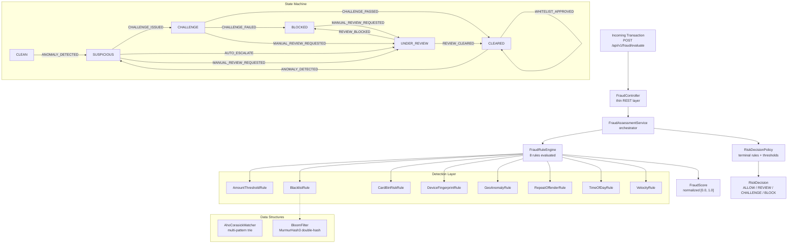

# fraud-shield - Real-Time Fraud Detection Engine

A self-contained fraud detection library with custom data structures, 8 composable fraud rules, and an antifraud state machine. Built for low-latency transaction scoring with no external ML dependencies.

## Features

- **Custom Bloom Filter** - O(k) blacklist lookups with configurable false-positive rate
- **Aho-Corasick pattern matcher** - O(n+m+z) multi-pattern text scanning for banned words, phishing URLs, weak passwords
- **8 fraud rules** - each isolated, independently testable, returns a scored `RuleResult`
- **Antifraud state machine** - per-case instance with typed transition context and in-memory audit trail
- **Risk decision policy** - configurable thresholds for ALLOW / REVIEW / CHALLENGE / BLOCK decisions
- **REST API** - `POST /api/v1/fraud/evaluate` for transaction scoring
- **Virtual Threads** - Spring Boot 3.2 virtual thread support enabled by default

## Algorithm Complexity

| Component | Build | Lookup/Search |
|---|---|---|
| Bloom Filter | O(k) per insert | O(k) per query, k = num hash functions |
| Aho-Corasick | O(sum of pattern lengths) | O(n + m + z): n=text, m=patterns, z=matches |
| Rule Engine | - | O(R) where R = number of rules |
| State Machine | - | O(1) transition lookup via Map |

The Bloom Filter uses MurmurHash3 double-hashing with optimal bit size and hash function count derived from `expectedInsertions` and target `falsePositiveProbability`:
- Bit size: `m = -n * ln(p) / (ln 2)^2`
- Hash functions: `k = (m/n) * ln(2)`

## Fraud Rules

| Rule | What it detects | Score |
|---|---|---|
| `AmountThresholdRule` | Transaction above high/medium threshold | 0.8 / 0.4 |
| `BlacklistRule` | User ID or merchant present in Bloom Filter blacklist | 1.0 |
| `CardBinRiskRule` | Card BIN associated with high-risk issuer | configurable |
| `DeviceFingerprintRule` | Missing or unrecognized device for this user | 0.4 / 0.6 |
| `GeoAnomalyRule` | Transaction country differs from last known country | 0.75 |
| `RepeatOffenderRule` | User has prior confirmed fraud incidents | 0.95 / 0.7 |
| `TimeOfDayRule` | Transaction in [01:00, 05:00) UTC | 0.45 |
| `VelocityRule` | Too many transactions in a short window | 0.9 / 0.5 |

All rules implement `FraudRule` and return `RuleResult(ruleType, score, reason, triggered)`. Rule types are defined in `FraudRuleType` enum for type-safe configuration. The engine aggregates scores using weighted average of triggered rules only, with configurable weights per rule type via `ScoringConfig`.

## Architecture



## Scoring and Decision

`FraudAssessmentService` orchestrates the full pipeline: rule evaluation, score aggregation, and risk decision. The `FraudRuleEngine` evaluates all 8 rules and produces a `FraudScore` - a normalized value in [0.0, 1.0] with validated invariants. Reasons are derived from triggered rule results (single source of truth).

`RiskDecisionPolicy` checks terminal rules first (e.g. blacklist triggers immediate BLOCK regardless of score), then interprets the score using configurable thresholds:

| Threshold | Default | Decision |
|---|---|---|
| Suspicious | >= 0.4 | REVIEW |
| High risk | >= 0.7 | CHALLENGE |
| Block | >= 0.9 | BLOCK |

Thresholds are externalized in `application.yml` under `fraud-shield.scoring.thresholds` and can be tuned without code changes. Configuration is validated at startup: thresholds must be in [0.0, 1.0] and strictly ordered (suspicious < highRisk < block).

## State Machine

The `AntifraudStateMachine` is a per-case instance that enforces valid transitions from a single source of truth - a `Map<FraudState, Map<FraudEvent, FraudState>>`. There is no separate validation table or switch expression; both `canTransition()` and `transition()` read from the same map.

Each transition requires a `TransitionContext(reasonCode, description, occurredAt)` - a typed audit record instead of a raw string. The `Instant` is passed from outside (no `Instant.now()` in domain logic), enabling deterministic tests and event replay.

States:
- `CLEAN` - never flagged
- `SUSPICIOUS` - anomaly detected, pending triage
- `CHALLENGE` - challenge issued to user
- `BLOCKED` - access denied
- `UNDER_REVIEW` - manual analyst review in progress
- `CLEARED` - previously flagged, now cleared

## Project Structure

```
src/main/java/com/fraudshield/
  bloom/           - Bloom filter + MurmurHash3 (custom, not Guava)
  pattern/         - Aho-Corasick multi-pattern string matcher
  rules/           - FraudRule interface, FraudRuleType enum, FraudRuleEngine
  rules/impl/      - 8 rule implementations (stateless)
  scoring/         - FraudAssessmentService, FraudScore, RiskDecision, RiskDecisionPolicy, ScoringConfig
  statemachine/    - AntifraudStateMachine, FraudState/FraudEvent enums, TransitionContext
  dto/request/     - EvaluateTransactionRequest (validated record)
  dto/response/    - FraudEvaluationResponse
  controller/      - Thin REST controller
  config/          - Spring Security configuration
```

## Requirements

- Java 21 (records, sealed interfaces, pattern matching in switch)
- Spring Boot 3.2
- No external ML dependencies - all scoring is rule-based

## Usage

```java
// Build blacklist
BloomFilter blacklist = new BloomFilter(100_000, 0.01);
blacklist.add("compromised-user-123");

// Pattern scanner for merchant names
AhoCorasickMatcher scanner = new AhoCorasickMatcher(List.of("casino", "darkweb", "crypto-mixer"));

// Evaluate transaction via REST
// POST /api/v1/fraud/evaluate
// Response: { fraudScore, decision, reasons, ruleResults }

// Drive state machine (per-case instance)
var stateMachine = new AntifraudStateMachine();
var context = TransitionContext.of("HIGH_SCORE", "Score=0.78 exceeded threshold", Instant.now());
stateMachine.transition(FraudEvent.ANOMALY_DETECTED, context);
stateMachine.history(); // immutable list of StateTransition records
```

## Release Status

**0.1.0** - API is stabilising but not yet frozen. Minor versions may include breaking changes until `1.0.0`.

---

## License

MIT - see [LICENSE](./LICENSE)
